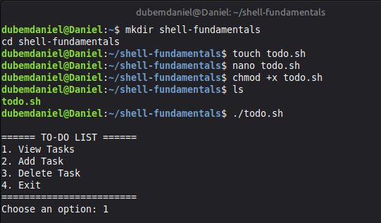
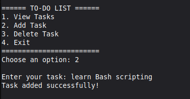
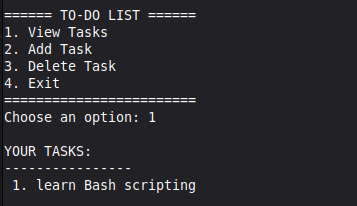
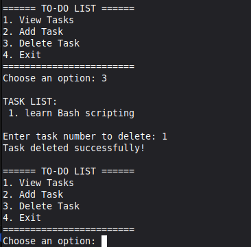

# To-Do List Manager

This is a simple Bash scripting project that allows users to manage tasks from the terminal.

---

# Features

- View tasks
- Add tasks
- Delete tasks
- Save tasks in ~/todo.txt

---

# How To Run

```bash
chmod +x todo.sh
./todo.sh
```

---

# Screenshots

## 1. Main Menu

Shows the main menu options.



---

## 2. Add Task

Shows adding a new task into the to-do list.



---

## 3. View Tasks

Displays all saved tasks with numbering.



---

## 4. Delete Task

Shows deleting a task using its number.


